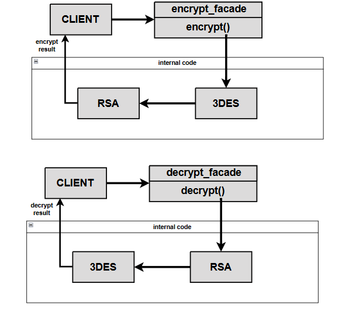

# Crypto Library 🔐

Um MVP para criptografia e descriptografia de informações sensiveis rapidamente utilizando Java, RSA e 3DES.

# 📁 Estrutura de Pastas - Arquitetura da aplicação

    src/main/java
    ├── application # Controla todas as entradas e saidas de dados recebidas pela aplicação através de uma classe FACADE.
    ├── infrastructure # Mantém todas configurações relacionadas ao tamanho máximo do output gerado na criptografia e criação das Keys.   
    ├── service    # Mantém as nossas implementações e regras relacionadas a criptografia e descriptografia.

# 🟡 Configuração Necessaria

```sh
Gradle >= 8.4 && Java >= 17 instalado && a IDE de sua preferência.
```

# 🔵 Desenvolvimento Local - Execução e Debug

```sh
não é necessario nenhum servidor Web, você pode testar a aplicação utilizando a classe LocalTest.java
```

# Tecnologias utilizadas

- Linguagem de programação:
  > Java
- Criptografia e Descriptografia
  > RSA + 3DES
- Arquitetura
  > Arquitetura em Camadas (Layered Architecture)
- Gerenciamento de dependencias
  > Gradle
- Documentação
  > Readme
  
# 📄 Release Notes (manter sempre atualizado)
- [Release/1.0.0](https://github.com/cunhaDev/crypto-library/tree/Release/1.0.0)
> Implementação das features de criptografia e descriptografia, documentação de apoio.
- [Release/2.0.0](https://github.com/cunhaDev/crypto-library/tree/Release/2.0.0)
> Inclusão da classe LocalTest para facilitação de testes e debugs, criação da documentação.

# ⚒️ WorkFlow do projeto


# ⚙️ Como implementar e utilizar em seu projeto
- Aplicações Gradle, adicione o seguinte código ao seu arquivo build.gradle (ainda não esta disponivel):
```sh
implementation 'com.mateus:crypto-library:1.0.0'
```
- Aplicações Maven, adicione o seguinte código ao seu arquivo pom.xml (ainda não esta disponivel):
```sh
<dependencies>
    <dependency>
        <groupId>com.mateus</groupId>
        <artifactId>crypto-library</artifactId>
        <version>1.0.0</version>
    </dependency>
</dependencies>

```

# 📚 Leitura recomendada
- [Arquitetura em Camadas](https://escolalbk.com.br/glossario/o-que-e-layered-architecture-arquitetura-em-camadas/)
- [Design Pattern FACADE](https://refactoring.guru/pt-br/design-patterns/facade)
- [Conhecendo RSA](https://www.baeldung.com/java-rsa)
- [Conhecendo 3DES](https://www.baeldung.com/java-3des)
